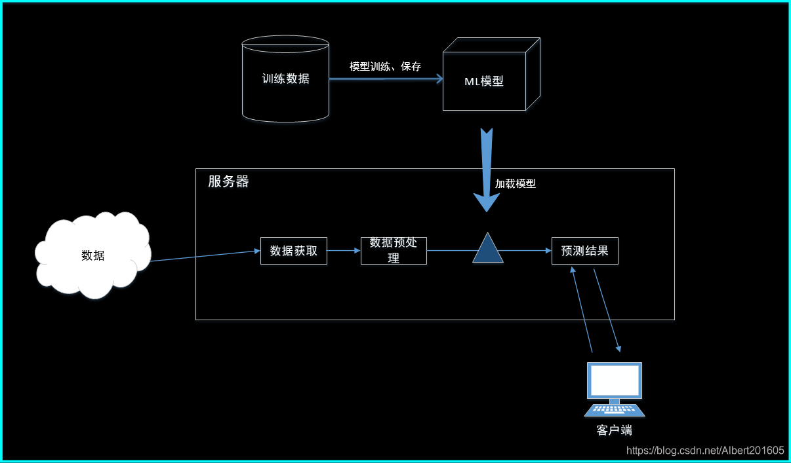
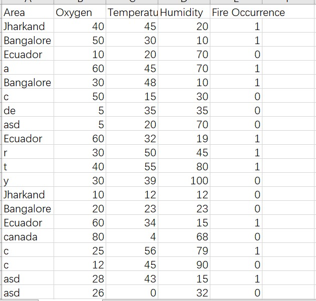
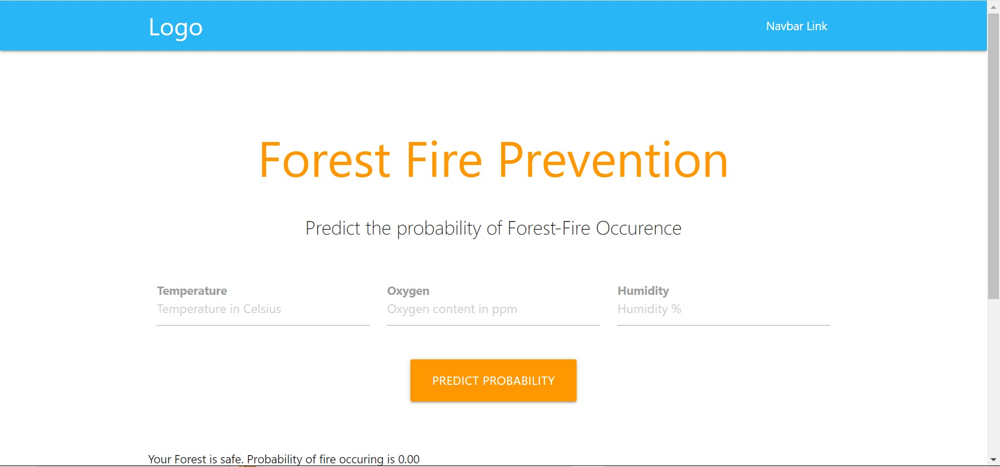

#### 一、部署结构

Flask是一个轻量级的Python Web开发框架，它自带了一个轻型服务器，可以部署Python 应用。对于python训练的机器学习模型，通过序列化和反序列化操作可以在Flask中进行部署。它的基本过程是，线下训练、保存模型，线上加载模型、部署应用。




#### 二、部署实现

##### 1.序列化和反序列化

序列化：指将一个对象转换为字节流，能够存储在文件或网络上，在python中使用pickle模块来实现。也就是把训练的模型保存为一个.pkl文件。

反序列化：指从字节流提取出对象。也就是加载.pkl模型文件。


##### 2.实现步骤

s1.安装python环境;

s2.安装flask，使用pip install flask命令直接安装；

s3.训练机器学习模型并保存；

s4.开发web应用，载入模型；

s5.运行应用，客户端进行访问。


#### 三、示例

建立一个线性回归模型进行火灾预测，并在服务器进行部署。




2.训练、保存模型

```python
import numpy as np
import pandas as pd
from sklearn.linear_model import LogisticRegression
from sklearn.model_selection import train_test_split
import warnings
import pickle
warnings.filterwarnings("ignore")

data = pd.read_csv("Forest_fire.csv")
data = np.array(data)

X = data[1:, 1:-1]
y = data[1:, -1]
y = y.astype('int')
X = X.astype('int')
# print(X,y)
X_train, X_test, y_train, y_test = 
                train_test_split(X, y, test_size=0.3, random_state=0)
log_reg = LogisticRegression()


log_reg.fit(X_train, y_train)

inputt=[int(x) for x in "45 32 60".split(' ')]
final=[np.array(inputt)]

b = log_reg.predict_proba(final)


pickle.dump(log_reg,open('model.pkl','wb'))
model=pickle.load(open('model.pkl','rb'))


```


3.开发web应用，载入模型

（1）web界面

```html
<!DOCTYPE html>
<html lang="en">
<head>
  <meta http-equiv="Content-Type" content="text/html; charset=UTF-8"/>
  <meta name="viewport" content="width=device-width, initial-scale=1, maximum-scale=1.0"/>
  <title>Starter Template - Materialize</title>

  <!-- CSS  -->
  <link href="https://fonts.googleapis.com/icon?family=Material+Icons" rel="stylesheet">
  <link href="./static/css/materialize.css" type="text/css" rel="stylesheet" media="screen,projection"/>
  <link href="./static/css/materialize.min.css" type="text/css" rel="stylesheet" media="screen,projection"/>
</head>

<body>
  <nav class="light-blue lighten-1" role="navigation">
    <div class="nav-wrapper container"><a id="logo-container" href="#" class="brand-logo">Logo</a>
      <ul class="right hide-on-med-and-down">
        <li><a href="#">Navbar Link</a></li>
      </ul>

      <ul id="nav-mobile" class="sidenav">
        <li><a href="#">Navbar Link</a></li>
      </ul>
      <a href="#" data-target="nav-mobile" class="sidenav-trigger"><i class="material-icons">menu</i></a>
    </div>
  </nav>


  <div class="section no-pad-bot" id="index-banner">
    <div class="container">
      <br><br>
      <h1 class="header center orange-text">Forest Fire Prevention</h1>
      <div class="row center">
        <h5 class="header col s12 light">Predict the probability of Forest-Fire Occurence
        <br>
        </h5>
      </div>

              <div class="row">
    <form action='/predict' method="post" class="col s12">
      <div class="row">
        <div class="input-field col s4">
            <label for="first_name"><b>Temperature</b></label>
            <br>
          <input placeholder="Temperature in Celsius" name="Temperature" id="first_name" type="text" class="validate">
        </div>
        <div class="input-field col s4">

          <label for="last_name"><b>Oxygen </b></label>
            <br>
          <input id="last_name" name="Oxygen" placeholder="Oxygen content in ppm"  type="text" class="validate">

        </div>

        <div class="input-field col s4">
            <label for="_name"><b>Humidity</b></label>
            <br>
          <input id="_name" name="Humidity" placeholder="Humidity %" type="text" class="validate">

        </div>

      </div>

      <div class="row center">

          <button type="submit" class="btn-large waves-effect waves-light orange">Predict Probability</button>
      </div>
    </form>
      </div>

      <br>
        {{pred}}<br>

    </div>
  </div>


    <br><br>
  </div>
  </div>>

  <!--  Scripts-->
  <script src="https://code.jquery.com/jquery-2.1.1.min.js"></script>
  <script src=".js/materialize.js"></script>
  <script src="js/init.js"></script>

  </body>
</html>


```


（2）服务器程序——载入模型，命名app.py

```python
from flask import Flask,request, url_for, redirect, render_template
import pickle
import numpy as np

app = Flask(__name__)

model=pickle.load(open('model.pkl','rb'))


@app.route('/')
def hello_world():
    return render_template("forest_fire.html")


@app.route('/predict',methods=['POST','GET'])
def predict():
    int_features=[int(x) for x in request.form.values()]
    final=[np.array(int_features)]
    print(int_features)
    print(final)
    prediction=model.predict_proba(final)
    output='{0:.{1}f}'.format(prediction[0][1], 2)

    if output>str(0.5):
        return render_template('forest_fire.html',pred='Your Forest is in Danger.\nProbability of fire occuring is {}'.format(output),bhai="kuch karna hain iska ab?")
    else:
        return render_template('forest_fire.html',pred='Your Forest is safe.\n Probability of fire occuring is {}'.format(output),bhai="Your Forest is Safe for now")


if __name__ == '__main__':
    app.run(debug=True)

```


4.访问测试

运行服务器程序：python app.py

